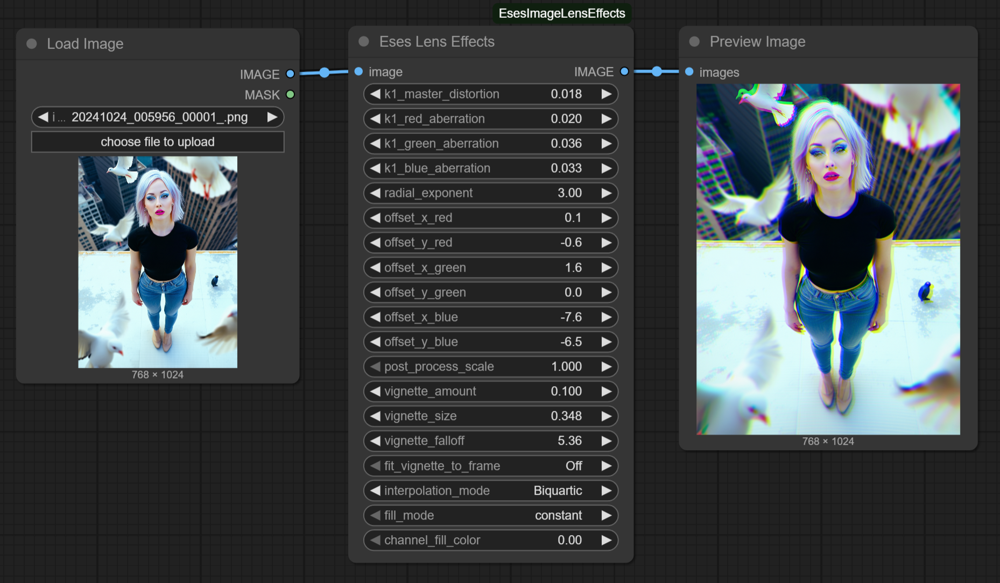

# Eses Image Lens Effects



## Description

The **'Eses Image Lens Effects'** node is a multipurpose node for ComfyUI designed to simulate a variety of lens characteristics. It combines several typical effects into a single, convenient node, allowing to add realistic or stylistic lens distortion, chromatic aberration, post-process scaling, and a highly configurable vignette.

💡 This node uses **scikit-image** and **PyTorch** for its calculations.

💡 If you are looking for a node that does many lens effects in one node, then why not give this one a try!

## Features

* **Lens Distortion & Chromatic Aberration**:
    * A **`k1_master_distortion`** control sets the primary barrel (bulge) or pincushion (squeeze) distortion for the entire image.
    * Channel-specific **`aberration`** spinners for Red, Green, and Blue act as offsets to the master distortion, creating controllable color fringing.
    * A global **`radial_exponent`** parameter fine-tunes the distortion's profile, controlling how quickly the effect ramps up from the image center outwards.

* **Post-Process Scaling**:
    * A **`post_process_scale`** slider allows for quick, centered zooming of the image.
    * This is suitable for cleanly cropping out the black areas or stretched pixels revealed at the edges by the lens distortion effect.

* **Flexible Vignette**:
    * A flexible vignette effect applied as the final step.
    * **`vignette_amount`**: Controls the intensity for both darkening (positive values) and lightening (negative values).
    * **`vignette_size`**: Adjusts the radius of the vignette, allowing it to cover more of the image or shrink into the corners.
    * **`vignette_falloff`**: Controls the hardness of the vignette's gradient curve.
    * **`fit_vignette_to_frame`**: A toggle to keep the vignette perfectly circular or stretch it to fit the image's aspect ratio.

* **Flexible Edge Handling & Quality**:
    * **`interpolation_mode`** for selecting resampling quality (e.g., Bilinear, Bicubic).
    * **`fill_mode`** to define how new pixels are handled at the boundaries.

## Installation

1.  **Navigate to your ComfyUI custom nodes directory:**
    ```
    ComfyUI/custom_nodes/
    ```

2.  **Clone this repository (or place files manually):**
    ```
    git clone https://github.com/quasiblob/ComfyUI-EsesImageLensEffects
    ```

3.  **Install requirements (If needed):**
    * You likely already have `scikit-image` installed. If not, you can run the following command inside this node's directory:
    ```
    pip install -r requirements.txt
    ```

4.  **Restart ComfyUI:**
    * After restarting, the **"Eses Lens Effects"** node will be available in the **"Eses Nodes/Image Adjustments"** category.

## Folder Structure

```
ComfyUI-EsesImageLensEffects/
├── __init__.py            # ComfyUI node definition.
├── image_lens_effects.py  # The Python file containing the node logic.
├── README.md              # This file.
├── docs/
└── examples/              # Node screenshots.
```


## Usage

The node is designed to be used in a logical order:

1.  Connect your image to the 'image' input.
2.  Adjust the **Distortion & Aberration** parameters to achieve the desired lens warp and color fringing.
3.  Use the **`post_process_scale`** slider to zoom in and re-frame the image, hiding any unwanted edges created by the distortion.
4.  Finally, apply a stylistic **Vignette** using its dedicated controls.
5.  Set the general `interpolation_mode` and `fill_mode` to control quality and edge handling.


## Category

Eses Nodes/Image Adjustments


## Contributing

* Feel free to report bugs and improvement ideas in issues, but I may not have time to do anything.


## License

* See LICENSE.txt


## Update History

* **2025.06.27 Version 1.0.0**: Initial release.


## ⚠️Disclaimer⚠️

This custom node for ComfyUI is provided "as is," without warranty of any kind, express or implied. By using this node, you agree that you are solely responsible for any outcomes or issues that may arise. Use at your own risk.


## Acknowledgements

Thanks to the ComfyUI team and community for their ongoing work!